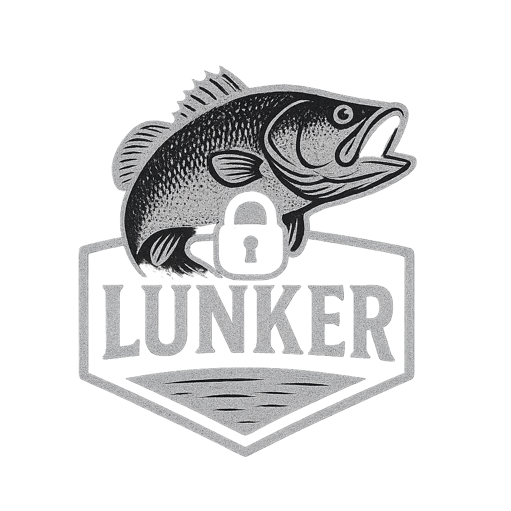

# Lunker

<p align="center">
  
</p>

Lunker is a multi-region AWS CDK application that allows users to register domains for threat intelligence monitoring. Users sign in with Amazon Cognito (passwordless) and manage a personal list of domains that are automatically checked against the [webmonitor](https://github.com/jblukach/webmonitor) threat intelligence service.

## Features

- **Passwordless authentication** via Amazon Cognito
- **Domain management** — add or remove domains to monitor (second-level domains only, e.g. `example.com`)
- **TLD validation** against the official [IANA TLD list](https://data.iana.org/TLD/tlds-alpha-by-domain.txt), refreshed daily
- **Automated threat lookups** triggered on domain registration via DynamoDB Streams
- **Multi-region** deployment across `us-east-1`, `us-east-2`, and `us-west-2`
- **Global DynamoDB table** replicated across all three regions
- **GitHub Actions CI/CD** via OIDC — no long-lived credentials required

## Architecture

Four AWS CDK stacks are deployed to provide full multi-region coverage:

| Stack | Region | Purpose |
|---|---|---|
| `LunkerDatabase` | us-east-2 | Global DynamoDB table, DynamoDB Streams, action Lambda |
| `LunkerStackUse1` | us-east-1 | Home Lambda (API), TLD Lambda, TLD DynamoDB table |
| `LunkerStackUse2` | us-east-2 | GitHub OIDC provider and IAM role for CI/CD |
| `LunkerStackUsw2` | us-west-2 | Home Lambda (API), TLD Lambda, TLD DynamoDB table |

### Lambda Functions

- **`action`** — Triggered by DynamoDB Streams on new domain inserts. Invokes the `searchlist` function in the webmonitor account to begin threat intelligence analysis.
- **`home`** — REST API handler. Validates OAuth2 tokens via Cognito, then handles domain listing, adding, and removing.
- **`tld`** — Runs daily at 10:00 UTC. Syncs the IANA TLD list into a regional DynamoDB table used to validate domain TLDs on submission.

### DynamoDB Tables

- **`lunker`** — Global table (primary in `us-east-2`, replicas in `us-east-1` and `us-west-2`) storing user-to-domain mappings. Point-in-time recovery and deletion protection enabled.
- **`tld`** — Regional table (per region) storing the current IANA TLD list for input validation.

## Prerequisites

- [AWS CDK](https://docs.aws.amazon.com/cdk/v2/guide/getting_started.html) v2
- Python 3.13
- AWS account bootstrapped with CDK qualifier `lukach`:
  ```
  cdk bootstrap --qualifier lukach
  ```
- The following SSM parameters present in each deployment account/region:
  - `/organization/id` — AWS Organizations ID
  - `/account/webmonitor` — Account ID of the webmonitor service account
- S3 buckets containing a `requests.zip` Lambda layer:
  - `packages-use1-lukach-io` (us-east-1)
  - `packages-usw2-lukach-io` (us-west-2)

## Deployment

```bash
# Install dependencies
pip install -r requirements.txt

# Deploy all stacks
cdk deploy --all

# Deploy a single stack
cdk deploy LunkerDatabase
```

The `CDK_DEFAULT_ACCOUNT` environment variable must be set (or resolved automatically via the AWS CLI) before deploying.

## Project Structure

```
app.py                    # CDK app entry point
requirements.txt          # Python dependencies
cdk.json                  # CDK configuration
lunker/
  lunker_database.py      # LunkerDatabase stack (us-east-2)
  lunker_stackuse1.py     # LunkerStackUse1 stack (us-east-1)
  lunker_stackuse2.py     # LunkerStackUse2 stack (us-east-2, CI/CD)
  lunker_stackusw2.py     # LunkerStackUsw2 stack (us-west-2)
action/
  action.py               # DynamoDB Streams Lambda handler
home/
  homeuse1.py             # Home API Lambda handler (us-east-1)
  homeusw2.py             # Home API Lambda handler (us-west-2)
tld/
  tld.py                  # IANA TLD sync Lambda handler
```

## License

[LICENSE](LICENSE)
